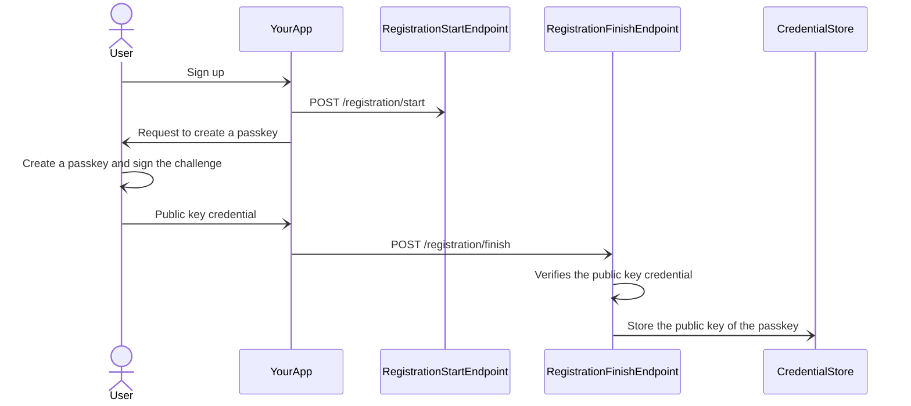
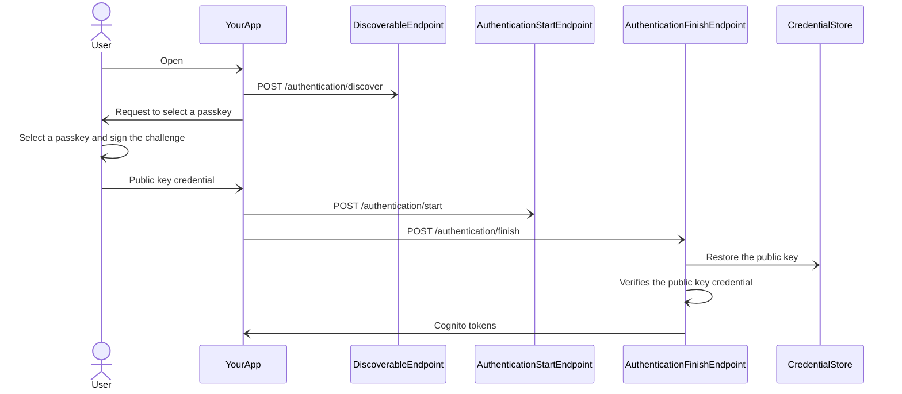
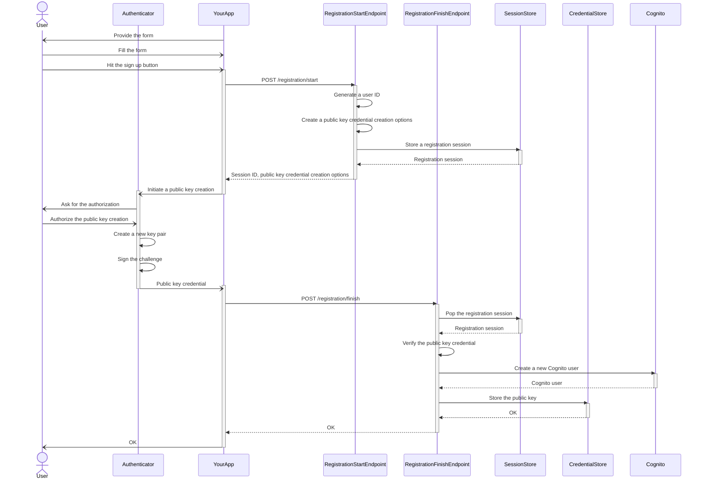
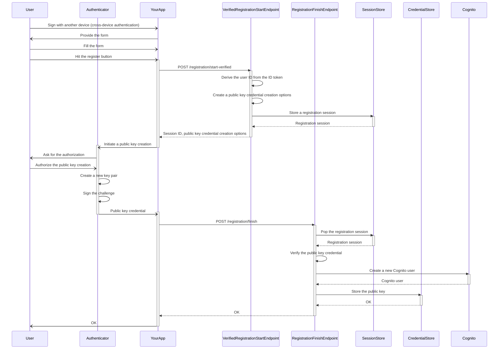
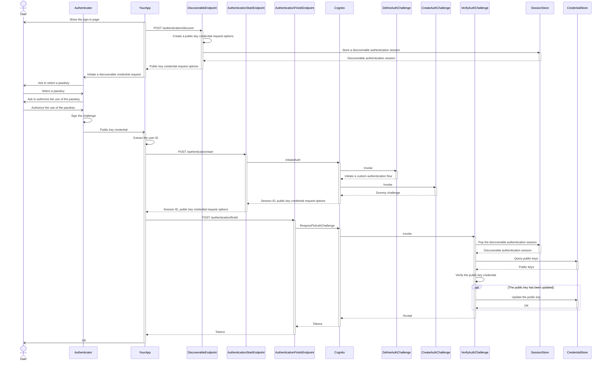
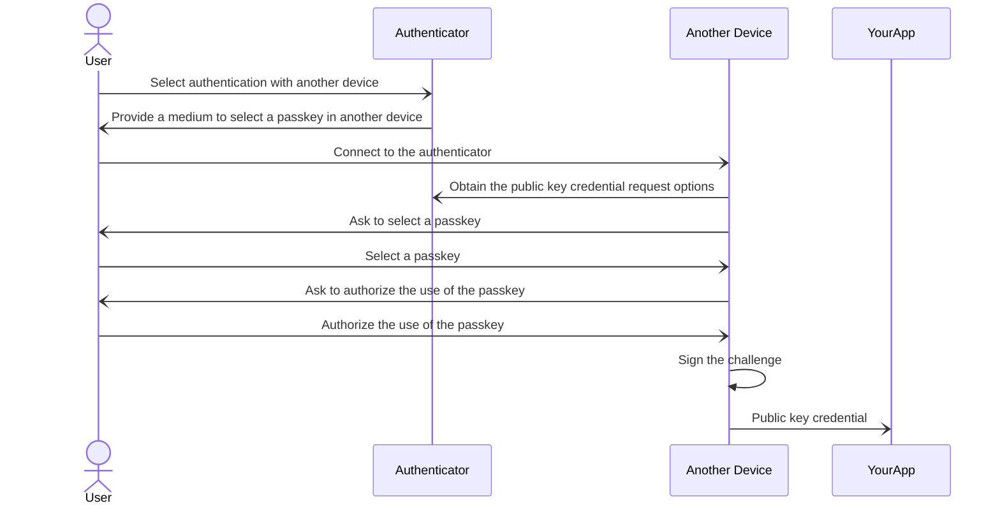
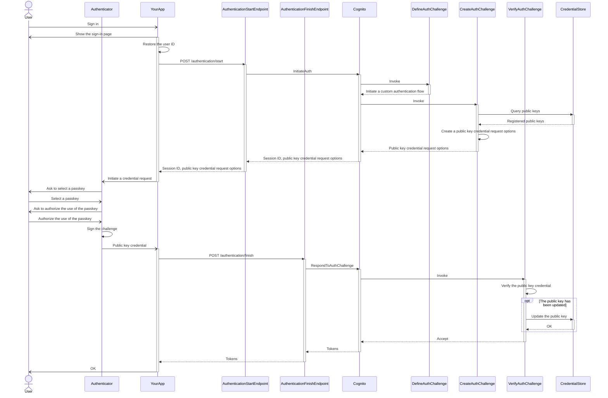

# Passquito


Fly with [Passkey](https://passkeys.dev) &times; [AWS Cognito](https://aws.amazon.com/cognito/) = Passquito!

A PoC on [passkey](https://passkeys.dev) authentication inspired by [`aws-samples/amazon-cognito-passwordless-auth`](https://github.com/aws-samples/amazon-cognito-passwordless-auth).

Features:
- [Rust](https://www.rust-lang.org) &times; [AWS Lambda](https://aws.amazon.com/lambda/) → Snappy cold start!
- [AWS Cognito](https://aws.amazon.com/cognito/) Lambda triggers
- &#x1F4A9; Ugly codebase

## Getting started

Passquito consists of two packages:
- [`@codemonger-io/passquito-cdk-construct`](./passquito-cdk-construct/) is a CDK construct which describes Passquito core resources on AWS.
- [`@codemonger-io/passquito-client-js`](./passquito-client-js/) is a JavaScript client library which facilitates the communication with Passquito core resources.

### Steps

1. Add `@codemonger-io/passquito-cdk-construct` to your CDK project (replace `0.0.3-abc1234` with the version you want to install):

    ```sh
    npm install @codemonger-io/passquito-cdk-construct@0.0.3-abc1234
    ```

   Note that `@codemonger-io/passquito-cdk-construct` is **only available from the GitHub npm registry** for now.
   Please refer to the [`README` of `@codemonger-io/passquito-cdk-construct`](./passquito-cdk-construct/README.md#installing-the-package) for more details.

2. Add `@codemonger-io/passquito-client-js` to your web application (replace `0.0.2-abc1234` with the version you want to install):

    ```sh
    npm install @codemonger-io/passquito-client-js@0.0.2-abc1234
    ```

   Note that `@codemonger-io/passquito-client-js` is **only available from the GitHub npm registry** for now.
   Please refer to the [`README` of `@codemonger-io/passquito-client-js`](./passquito-client-js/README.md#installing-the-package) for more details.

3. Include `PassquitoCore` in your CDK stack:

    ```ts
    import { Stack } from 'aws-cdk-lib';
    import type { Construct } from 'constructs';

    import { PassquitoCore } from '@codemonger-io/passquito-cdk-construct';

    export class CdkStack extends Stack {
        constructor(scope: Construct, id: string) {
            super(scope, id);

            const passquito = new PassquitoCore(this, 'Passquito');
        }
    }
    ```

4. Use `@codemonger-io/passquito-client-js` in your web application to communicate with Passquito core resources.
   Please refer to the [API documentation](./passquito-client-js/api/markdown/index.md) for how to use it.

## Usage scenarios in a nutshell

### Registration

1. A *user* signs up to *your app*.

2. *Your app* starts a *registration session* by sending a request to the *registration start endpoint* (`POST /registration/start`).

3. *Your app* requests the *user* to create a *passkey*.

4. The *user* creates a *passkey* and signs the *challenge* associated with the *registration session* → the *signature*.

5. The *user* provides *your app* with a *public key credential* which includes the *public key* of the *passkey* and the *signature*.

6. *Your app* finishes the *registration session* by sending a request to the *registration finish endpoint* (`POST /registration/finish`).

7. The *registration finish endpoint* verifies the *public key credential*.

8. The *registration finish endpoint* stores the *public key* in the *credential store* for future authentication of the *user*.

Sequence diagram:



### Authentication

1. A *user* opens *your app*.

2. *Your app* starts a *discoverable authentication session* by sending a request to the *discoverable endpoint* (`POST /authentication/discover`).

3. *Your app* requests the *user* to select a *passkey* that is associated with *your app*.

4. The *user* selects a *passkey* and signs the *challenge* associated with the *discoverable authentication session* → the *signature*.

5. The *user* provides *your app* with a *public key credential* which includes the *key ID* of the *passkey* and the *signature*.

6. *Your app* initiates a *Cognito authentication session* by sending a request to the *authentication start endpoint* (`POST /authentication/start`) but **ignores the challenge returned from this endpoint**.

7. *Your app* finishes the *Cognito authentication session* by sending the *challenge* and the *public key credential* to the *authentication finish endpoint* (`POST /authentication/finish`).

8. The *authentication finish endpoint* restores the *public key* associated with the *key ID* from the *credential store*.

9. The *authentication finish endpoint* verifies the *public key credential*.

9. The *authentication finish endpoint* issues *Cognito tokens* to *your app*.

Sequence diagram:



## Detailed usage scenarios

The usage scenarios consist of two major parts:
1. [Registration](#registration-scenarios)
2. [Authentication](#authentication-scenarios)

### Registration scenarios

The registration scenarios have two variations:
1. [Registration of a new user](#registration-of-a-new-user)
2. [Registration of a new device of an existing user](#registration-of-a-new-device-of-an-existing-user)

The following sections in [_Web Authentication: An API for accessing Public Key Credentials Level 3_](https://www.w3.org/TR/webauthn-3/) are recommended to read for better understanding of the scenarios:
- [1.2.1. Registration](https://www.w3.org/TR/webauthn-3/#sctn-usecase-registration)
- [1.3.1. Registration](https://www.w3.org/TR/webauthn-3/#sctn-sample-registration)

#### Registration of a new user

1. *Your app* provides a *form* for a *user* to sign up.

2. The *user* fills the *form* with the *username* and the *display name*.

   Neither the *username* nor the *display name* are necessarily unique.
   They are provided for the *user* to locate the *passkey* in *user*'s device.

3. The *user* hits the *sign up* button.

4. *Your app* POSTs the *username* and the *display name* to the *registration start endpoint* (`/registration/start`).

5. The *registration start endpoint* generates a unique ID for the *user* → the *user ID*.

6. The *registration start endpoint* creates a *public key credential creation options* which includes a *challenge*.

   The __*user handle* of the *public key credential creation options* is equal to the *user ID*__.

7. The *registration start endpoint* stores a new *registration session* in the *session store*.

   The *registration session* includes the following parameters:
   - *session ID*: the primary key
   - *user ID*
   - *username*
   - *display name*
   - *challenge*

8. The *registration start endpoint* returns the *session ID* and *public key credential creation options* to *your app*.

9. *Your app* initiates public key creation with the *public key credential creation options*.

10. The *user* authorizes the public key creation.

11. *User's authenticator* creates a new key pair (a *private key* and a *public key*).

12. *User's authenticator* signs the *challenge* with the *private key* → the *signature*.

13. *User's authenticator* returns a *public key credential* which includes the *public key* and the *signature* to *your app*.

14. *Your app* POSTs the *session ID* and the *public key credential* to the *registration finish endpoint* (`/registration/finish`).

15. The *registration finish endpoint* pops the *registration session* associated with the *session ID* from the *session store*.

16. The *registration finish endpoint* verifies the *public key credential*.

    The following parameters are involved in the verification:
    - *challenge*
    - *public key*
    - *signature*

17. The *registration finish endpoint* creates a new *Cognito user* with the following attributes:
    - `username`: *user ID*
    - `preferred_username`: *username*
    - `name`: *display name*

    **The *Cognito user* is provided with a random password, which is confirmed upon creation; i.e., the *user* never faces it.**

18. The *registration finish endpoint* stores the *public key* along with the following parameters in the *credential store*:
    - *user ID*: the primary key
    - The *credential ID* of the *public key*: the primary key
    - The *sub* attribute of the *Cognito user*

19. The *registration finish endpoint* returns an empty OK response to *your app*.

Sequence diagram:



#### Registration of a new device of an existing user

This scenario supposes that the *user* has a valid *passkey* in another device.

1. A *user* opens *your app* in a *new device*.

2. The *user* signs in to *your app* with a *passkey* in *another device* through cross-device authentication, and receives an *ID token*.

   See [Section _Authentication scenarios_](#authentication-scenarios) for the details of authentication.

3. *Your app* shows a *form* for the *user* to register a new device.

4. The *user* fills the *form* with the *username* and the *display name*.

   Neither the *username* nor the *display name* are necessarily unique.
   They are provided for the *user* to locate the *passkey* in the *new device*.

5. The *user* hits the *register* button.

6. *Your app* POSTs the *username* and the *display name* to the *verified registration start endpoint* (`/registration/start-verified`).

7. The *verified registration start endpoint* authenticates the *user* with the *ID token*.

8. The *verified registration start endpoint* derives the *user ID* from the *ID token*.

   (The following steps are equivalent to the steps in [Scenario _Registration of a new user_](#registration-of-a-new-user).)

9. The *verified registration start endpoint* creates a *public key credential creation options* which includes a *challenge*.

   The __*user handle* of the *public key credential creation options* is equal to the *user ID*__.

10. The *verified registration start endpoint* stores a new *registration session* in the *session store*.

    The *registration session* includes the following parameters:
    - *session ID*: the primary key
    - *user ID*
    - *username*
    - *display name*
    - *challenge*

11. The *verified registration start endpoint* returns the *session ID* and *public key credential creation options* to *your app*.

12. *Your app* initiates public key creation with the *public key credential creation options*.

13. The *user* authorizes the public key creation.

14. *User's authenticator* in the *new device* creates a new key pair (a *private key* and a *public key*).

15. *User's authenticator* in the *new device* signs the *challenge* with the *private key* → the *signature*.

16. *User's authenticator* in the *new device* returns a *public key credential* which includes the *public key* and the *signature* to *your app*.

17. *Your app* POSTs the *session ID* and the *public key credential* to the *resigration finish endpoint* (`/registration/finish`).

18. The *registration finish endpoint* pops the *registration session* associated with the *session ID* from the *session store*.

19. The *registration finish endpoint* verifies the *public key credential*.

    The following parameters are involved in the verification:
    - *challenge*
    - *public key*
    - *signature*

20. The *registration finish endpoint* creates a new *Cognito user* with the following attributes:
    - `username`: *user ID*
    - `preferred_username`: *username*
    - `name`: *display name*

    **The *Cognito user* is provided with a random password, which is confirmed upon creation; i.e., the *user* never faces it.**

21. The *registration finish endpoint* stores the *public key* along with the following parameters in the *credential store*:
    - *user ID*: the primary key
    - The *credential ID* of the *public key*: the primary key
    - The *sub* attribute of the *Cognito user*

22. The *registration finish endpoint* returns an empty OK response to *your app*.

Sequence diagram:



### Authentication scenarios

The authentication scenarios have two variations:
1. [Authentication with discoverable credentials](#authentication-with-discoverable-credentials)
2. [Authentication of a specific user](#authentication-of-a-specific-user)

The authentication sceanrios utilize the custom authentication challenge Lambda triggers of *AWS Cognito* to implement a custom authentication flow.
Please refer to [Section _Custom authentication challenge Lambda triggers_ in _Amazon Cognito Developer Guide_](https://docs.aws.amazon.com/cognito/latest/developerguide/user-pool-lambda-challenge.html) for better understanding of the custom authentication flow.

#### Authentication with discoverable credentials

1. *Your app* shows a web page for a *user* to sign in.

2. *Your app* sends a POST request to the *discoverable endpoint* (`/authentication/discover`).

3. The *discoverable endpoint* creates a *public key credential request options* which include a *challenge* and a *relying party ID*.

4. The *discoverable endpoint* stores a new *discoverable authentication session* in the *session store*.

   The *discoverable authentication session* includes the following parameters:
   - *challenge*: the primary key
   - *public key credential request options*

5. The *discoverable endpoint* returns the *public key credential request options* to *your app*.

6. *Your app* initiates a discoverable credential request with the *public key credential request options*.

7. *User's authenticator* asks the *user* to select a *passkey* from those associated with the *relying party ID* in *user's authenticator*.

   A *passkey* includes a key pair of a *private key* and a *public key*.

8. The *user* selects a *passkey*.

9. *User's authenticator* asks the *user* to authorize the use of the *passkey*.

10. The *user* authorizes the use of the *passkey*; e.g., using biometrics.

11. *User's authenticator* signs the *challenge* with the *private key* → the *signature*.

12. *User's authenticator* returns a *public key credential* which includes the *public key* and the *signature* to *your app*.

13. *Your app* extracts the *user handle* from the *public key credential*, which is __equal to the *user ID*__.

14. *Your app* POSTs the *user ID* to the *authentication start endpoint* (`/authentication/start`).

15. The *authentication start endpoint* calls the *InitiateAuth* AWS Cognito API with the following parameters:
    - `AuthFlow`: `"CUSTOM_AUTH"`
    - `AuthParameters`:
      - `USERNAME`: *user ID*

16. *AWS Cognito* invokes the *define auth challenge trigger*.

17. The *define auth challenge trigger* initiates a custom authentication flow.

18. *AWS Cognito* invokes the *create auth challenge trigger*.

19. The *create auth challenge trigger* returns a dummy challenge parameter.

    __The true *challenge* was created at Step 3.__

20. *AWS Cognito* returns a *session ID* and *public key credential request options* to the *authentication start endpoint*.

21. The *authentication start endpoint* returns the *session ID* and the *public key credential request options* to *your app*.

    __The *public key credential request options* returned here are never used.__

22. *Your app* POSTs the following parameters to the *authentication finish endpoint* (`/authentication/finish`):
    - *session ID*
    - *public key credential*
    - *user ID*

23. The *authentication finish endpoint* calls the *RespondToAuthChallenge* AWS Cognito API with the following parameters:
    - `ChallengeName`: `"CUSTOM_CHALLENGE"`
    - `Session`: *session ID*
    - `ChallengeResponses`:
      - `USERNAME`: *user ID*
      - `ANSWER`: *public key credential*

24. *AWS Cognito* invokes the *verify auth challenge trigger*.

25. The *verify auth challenge trigger* pops the *discoverable authentication session* associated with the *challenge* from the *session store*.

    **This is the *discoverable authentication session* stored at Step 4.**

26. The *verify auth challenge trigger* queries the *credential store* for the *public keys* associated with the *user ID*.

27. The *verify auth challenge trigger* verifies the *public key credential*.

    The following parameters are involved in the verification:
    - *challenge*
    - *public keys*
    - *signature*

28. The *verify auth challenge trigger* updates the used *public key* in the *credential store* if necessary.

29. The *verify auth challenge trigger* accepts the *public key credential*.

30. *AWS Cognito* returns *tokens* to the *authentication finish endpoint*.

    The *tokens* consist of:
    - *access token*
    - *ID token*
    - *refresh token*

31. The *authentication finish endpoint* returns the *tokens* to *your app*.

Sequence diagram:



##### Cross-device authentication

A *user* may sign in to *your app* with a *passkey* stored in another device through cross-device authentication.
In cross-device authentication, Step 8 through Step 12 will be replaced with the following steps:

1. The *user* selects authentication with *another device*.

2. *User's authenticator* provides a medium for the *user* to select a *passkey* from *another device*.

   Usually, the medium is a combination of a QR code and Bluetooth.

3. The *user* connects *another device* to *user's authenticator*.

4. *Another device* obtains the *public key credential request options* from *user's authenticator*.

5. *Another device* asks the *user* to select a *passkey* from those associated with the *relying party ID* in *another device*.

   A *passkey* includes a key pair of a *private key* and a *public key*.

6. The *user* selects a *passkey*.

7. *Another device* asks the *user* to authorize the use of the *passkey*.

8. The *user* authorizes the use of the *passkey*; e.g., using biometrics.

9. *Another device* signs the *challenge* with the *private key* → the *signature*.

10. *Another device* returns a *public key credential* which includes the *public key* and the *signature* to *your app*.

Sequence diagram:



#### Authentication of a specific user

1. A *user* has previously signed in to *your app* with a *passkey*.

2. *Your app* shows a web page for a *user* to sign in.

3. *Your app* restores the *user ID* of the *user* from the browser storage; e.g., the local storage.

4. *Your app* POSTs the *user ID* to the *authentication start endpoint* (`/authentication/start`).

5. The *authentication start endpoint* calls the *InitiateAuth* AWS Cognito API with the following parameters:
   - `AuthFlow`: `"CUSTOM_AUTH"`
   - `AuthParameters`:
     - `USERNAME`: *user ID*

6. *AWS Cognito* invokes the *define auth challenge trigger*.

7. The *define auth challenge trigger* initiates a custom authentication flow.

8. *AWS Cognito* invokes the *create auth challenge trigger*.

9. The *create auth challenge trigger* lists the *public keys* associated with the *user ID* in the *credential store* → *registered public keys*.

10. The *create auth challenge trigger* creates a *public key credential request options* which include a *challenge*, a *relying party ID*, and the *registered public keys*.

11. The *create auth challenge trigger* returns the *public key credential request options* to *AWS Cognito*.

12. *AWS Cognito* returns a *session ID* and the *public key credential request options* to the *authentication start endpoint*.

13. The *authentication start endpoint* returns the *session ID* and the *public key credential request options* to *your app*.

14. *Your app* initiates a credential request with the *public key credential request options*.

15. *User's authenticator* asks the *user* to select a *passkey* from those associated with the *relying party ID* and the *registered public keys* in *user's authenticator*.

    A *passkey* includes a key pair of a *private key* and a *public key*.

16. The *user* selects a *passkey*.

17. *User's authenticator* asks the *user* to authorize the user of the *passkey*.

18. The *user* authorizes the use of the *passkey*; e.g., using biometrics.

19. *User's authenticator* signs the *challenge* with the *private key* → the *signature*.

20. *User's authenticator* returns a *public key credential* which includes the *public key* and the *signature* to *your app*.

21. *Your app* POSTs the following parameters to the *authentication finish endpoint* (`/authentication/finish`):
    - *session ID*
    - *public key credential*
    - *user ID*

22. The *authentication finish endpoint* calls the *RespondToAuthChallenge* AWS Cognito API with the following parameters:
    - `ChallengeName`: `"CUSTOM_CHALLENGE"`
    - `Session`: *session ID*
    - `ChallengeResponses`:
      - `USERNAME`: *user ID*
      - `ANSWER`: *public key credential*

23. *AWS Cognito* invokes the *verify auth challenge trigger*.

24. The *verify auth challenge trigger* verifies the *public key credential*.

    The following parameters are involved in the verification:
    - *challenge*
    - *registered public keys*
    - *signature*

25. The *verify auth challenge trigger* updates the used *public key* in the *credential store* if necessary.

26. The *verify auth challenge trigger* accepts the *public key credential*.

27. *AWS Cognito* returns tokens to the *authentication finish endpoint*.

    The *tokens* consist of:
    - *access token*
    - *ID token*
    - *refresh token*

28. The *authentication finish endpoint* returns the *tokens* to *your app*.

Sequence diagram:



## License

[MIT License](./LICENSE)

Except for the following materials licensed under _CC BY-SA 4.0_ (<https://creativecommons.org/licenses/by-sa/4.0/>):
- [_Passquito Logo_](./passquito.png) by [codemonger](https://codemonger.io)