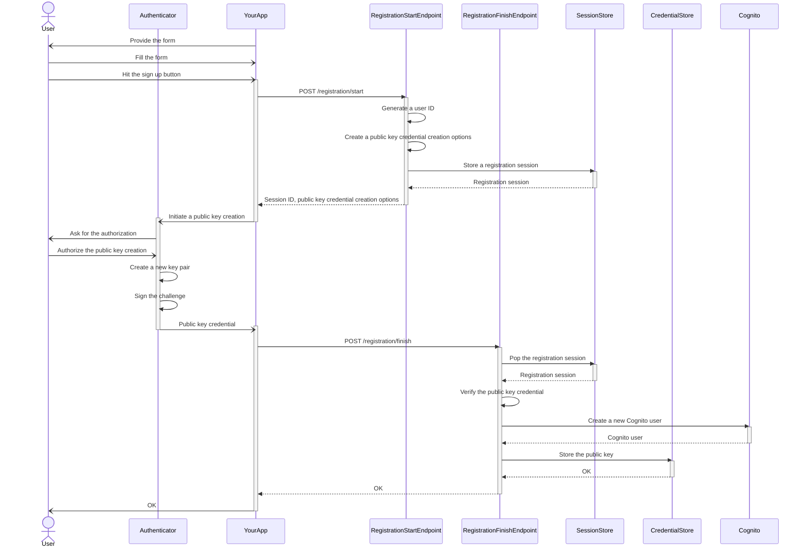
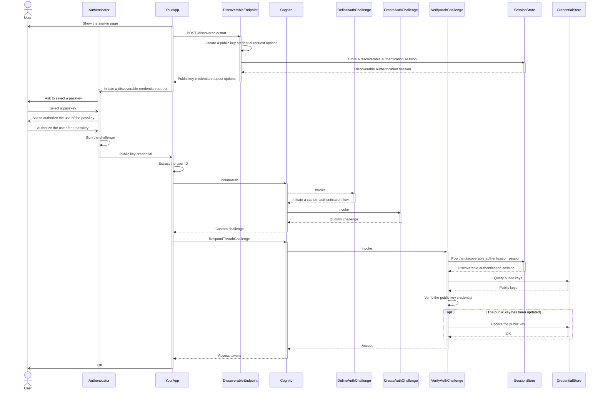

# Passquito

Fly with [Passkey](https://passkeys.dev) &times; [AWS Cognito](https://aws.amazon.com/cognito/) = Passquito!

A PoC on [passkey](https://passkeys.dev) authentication inspired by [`aws-samples/amazon-cognito-passwordless-auth`](https://github.com/aws-samples/amazon-cognito-passwordless-auth).

Features:
- [Rust](https://www.rust-lang.org) &times; [AWS Lambda](https://aws.amazon.com/lambda/) → Snappy cold start!
- [AWS Cognito](https://aws.amazon.com/cognito/) Lambda triggers
- &#x1F4A9; Ugly codebase

## Usage scenarios and some details

The usage scenarios consist of two major parts:
1. [Registration](#registration-scenarios)
2. [Authentication](#authentication-scenarios)

### Registration scenarios

The registration scenarios have two variations:
1. [Registration of a new user](#registration-of-a-new-user)
2. [Registration of a new device of an existing user](#registration-of-a-new-device-of-an-existing-user)

The following sections in [_Web Authentication: An API for accessing Public Key Credentials Level 3_](https://www.w3.org/TR/webauthn-3/) are recommended to read for better understanding of the scenarios:
- [1.2.1. Registration](https://www.w3.org/TR/webauthn-3/#sctn-usecase-registration)
- [1.3.1. Registration](https://www.w3.org/TR/webauthn-3/#sctn-sample-registration)

#### Registration of a new user

1. *Your app* provides a *form* for a *user* to sign up.

2. The *user* fills the *form* with the *username* and the *display name*.

   Neither the *username* nor the *display name* are necessarily unique.
   They are provided for the *user* to locate the *passkey* in *user*'s device.

3. The *user* hits the *sign up* button.

4. *Your app* POSTs the *username* and the *display name* to the *registration start endpoint* (`/registration/start`).

5. The *registration start endpoint* generates a unique ID for the *user* → the *user ID*.

6. The *registration start endpoint* creates a *public key credential creation options* which includes a *challenge*.

   The __*user handle* of the *public key credential creation options* is the *user ID*__.

7. The *registration start endpoint* stores a new *registration session* in the *session store*.

   The *registration session* includes the following parameters:
   - *session ID*: the primary key
   - *user ID*
   - *username*
   - *display name*
   - *challenge*

8. The *registration start endpoint* returns the *session ID* and *public key credential creation options* to *your app*.

9. *Your app* initiates a public key creation with the *public key credential creation options*.

10. The *user* authorizes the public key creation.

11. *User's authenticator* creates a new key pair (a *private key* and a *public key*).

12. *User's authenticator* signs the *challenge* with the *private key* → the *signature*.

13. *User's authenticator* returns a *public key credential* which includes the *public key* and the *signature* to *your app*.

14. *Your app* POSTs the *session ID* and the *public key credential* to the *registration finish endpoint* (`/registration/finish`).

15. The *registration finish endpoint* pops the *registration session* associated with the *session ID* from the *session store*.

16. The *registration finish endpoint* verifies the *public key credential*.

    The following parameters are involved in the verification:
    - *challenge*
    - *public key*
    - *signature*

17. The *registration finish endpoint* creates a new *Cognito user* with the following attributes:
    - `username`: *user ID*
    - `preferred_username`: *username*
    - `name`: *display name*

    **The *Cognito user* is provided with a random password, which is confirmed upon creation; i.e., the *user* never faces it.**

18. The *registration finish endpoint* stores the *public key* along with the following parameters in the *credential store*:
    - *user ID*: the primary key
    - The *credential ID* of the *public key*: the primary key
    - The *sub* attribute of the *Cognito user*

19. The *registration finish endpoint* returns an empty OK response to *your app*.

Sequence diagram:

#### Registration of a new device of an existing user

TBD

### Authentication scenarios

The authentication scenarios have two variations:
1. [Authentication with discoverable credentials](#authentication-with-discoverable-credentials)
2. [Authentication of a specific user](#authentication-of-a-specific-user)

The authentication sceanrios utilize the custom authentication challenge Lambda triggers of *AWS Cognito* to implement a custom authentication flow.
Please refer to [Section _Custom authentication challenge Lambda triggers_ in _Amazon Cognito Developer Guide_](https://docs.aws.amazon.com/cognito/latest/developerguide/user-pool-lambda-challenge.html) for better understanding of the custom authentication flow.

#### Authentication with discoverable credentials

1. *Your app* shows a web page for a *user* to sign in.

2. *Your app* sends a POST request to the *discoverable endpoint* (`/discoverable/start`).

3. The *discoverable endpoint* creates a *public key credential request options* which include a *challenge* and a *relying party ID*.

4. The *discoverable endpoint* stores a new *discoverable authentication session* in the *session store*.

   The *discoverable authentication session* includes the following parameters:
   - *challenge*: the primary key
   - *public key credential request options*

5. The *discoverable endpoint* returns the *public key credential request options* to *your app*.

6. *Your app* initiates a discoverable credential request with the *public key credential request options*.

7. *User's authenticator* asks the *user* to select a *passkey* from those associated with the *relying party ID* in *user's authenticator*.

   A *passkey* includes a key pair of a *private key* and a *public key*.

8. The *user* selects a *passkey*.

9. *User's authenticator* asks the *user* to authorize the use of the *passkey*.

10. The *user* authorizes the use of the *passkey*.

11. *User's authenticator* signs the *challenge* with the *private key* → the *signature*.

12. *User's authenticator* returns a *public key credential* which includes the *public key* and the *signature* to *your app*.

13. *Your app* extracts the *user handle* from the *public key credential*, which is __equal to the *user ID*__.

14. *Your app* calls the *InitiateAuth* AWS Cognito API with the following parameters:
    - `AuthFlow`: `"CUSTOM_AUTH"`
    - `AuthParameters`:
      - `USERNAME`: *user ID*

15. *AWS Cognito* invokes the *define auth challenge trigger*.

16. The *define auth challenge trigger* initiates a custom authentication flow.

17. *AWS Cognito* invokes the *create auth challenge trigger*.

18. The *create auth challenge trigger* returns a dummy challenge parameter.

    __The true *challenge* was created at Step 3.__

19. *AWS Cognito* returns a *custom challenge* to *your app*.

20. *Your app* calls the *RespondToAuthChallenge* AWS Cognito API with the following parameters:
    - `ChallengeName`: `"CUSTOM_CHALLENGE"`
    - `Session`: the session associated with the *custom challenge*
    - `ChallengeResponses`:
      - `USERNAME`: *user ID*
      - `ANSWER`: the *public key credential*

21. *AWS Cognito* invokes the *verify auth challenge trigger*.

22. The *verify auth challenge trigger* pops the *discoverable authentication session* associated with the *challenge* from the *session store*.

    **This is the *discoverable authentication session* stored at Step 4.**

23. The *verify auth challenge trigger* queries the *credential store* for the *public keys* associated with the *user ID*.

24. The *verify auth challenge trigger* verifies the *public key credential*.

    The following parameters are involved in the verification:
    - *challenge*
    - *public keys*
    - *signature*

25. The *verify auth challenge trigger* updates the used *public key* in the *credential store* if necessary.

26. The *verify auth challenge trigger* accepts the *public key credential*.

27. *AWS Cognito* returns an access tokens to *your app*.

Sequence diagram:

#### Authentication of a specific user

This is not precisely a passkey authentication, but a passwordless authentication.