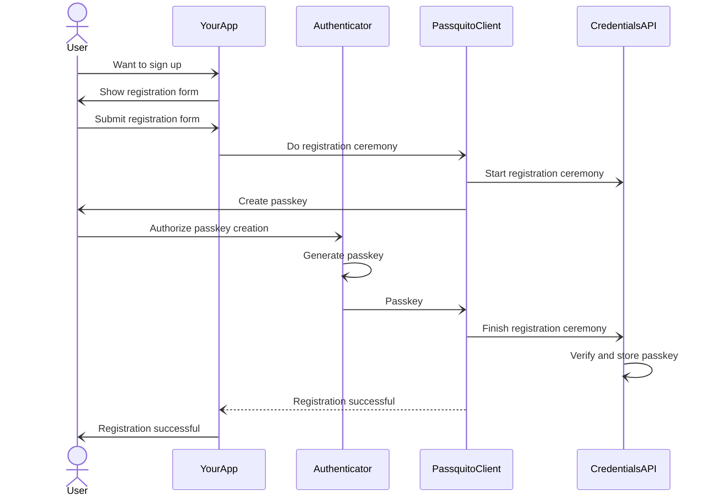
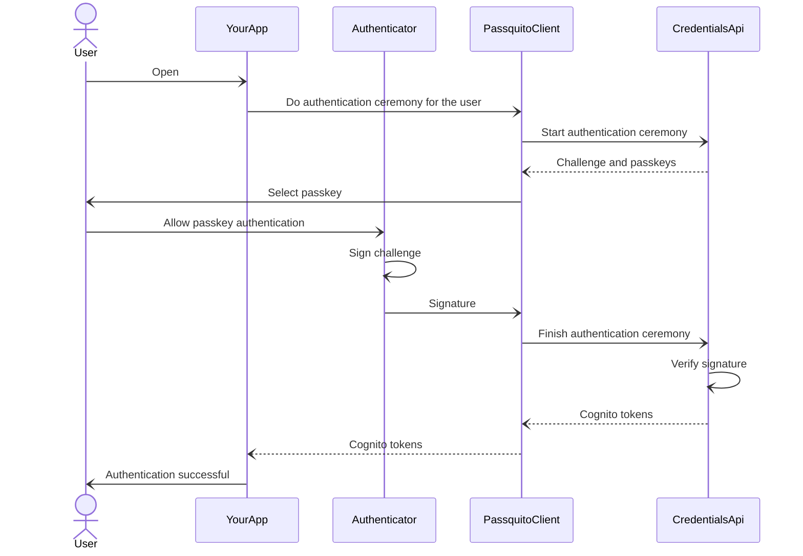

# @codemonger-io/passquito-client-js

Passquito client for web applications.

## Getting started

### Installing the package

`@codemonger-io/passquito-client-js` is not available on npm yet.
Instead, _developer packages_ [^1] are available on the npm registry managed by GitHub Packages.
You can find packages [here](https://github.com/codemonger-io/passquito/pkgs/npm/passquito-client-js).

[^1]: A _developer package_ is published to the GitHub npm registry, whenever commits are pushed to the `main` branch of this repository.
It has a special version number followed by a dash (`-`) plus a short commit hash; e.g., `0.0.3-abc1234` where `abc1234` is the short commit hash (the first 7 characters) of the commit used to build the package (_snapshot_).

#### Configuring a GitHub personal access token

To install a developer package, you need to configure a **classic** GitHub personal access token (PAT) with at least the `read:packages` scope.
Please refer to the [GitHub documentation](https://docs.github.com/en/authentication/keeping-your-account-and-data-secure/managing-your-personal-access-tokens#creating-a-personal-access-token-classic) for how to create a PAT.

Once you have a PAT, create a `.npmrc` file in your home directory with the following content (please replace `$YOUR_GITHUB_PAT` with your actual PAT):

```
//npm.pkg.github.com/:_authToken=$YOUR_GITHUB_PAT
```

In the root directory of your project, create another `.npmrc` file with the following content:

```
@codemonger-io:registry=https://npm.pkg.github.com
```

Then you can install a _developer package_ with the following command:

```sh
npm install @codemonger-io/passquito-client-js@0.0.3-abc1234
```

Please replace `0.0.3-abc1234` with the actual version number of the _snapshot_ you want to install, which is available in the [package repository](https://github.com/codemonger-io/passquito/pkgs/npm/passquito-client-js).

### Usage in a nutshell

1. [Initialization](#initialization)
2. [Registration](#registration)
3. Authentication
   - [Authentication with discoverable credentials](#authentication-with-discoverable-credentials)
   - [Authentication of a specific user](#authentication-of-a-specific-user)

#### Initialization

1. *Your app* checks if *user*'s browser supports *passkeys*.

   You can use the following utility functions to check *passkey* capabilities of the browser:
   - [`checkPasskeyRegistrationSupported`](https://github.com/codemonger-io/passquito/blob/main/passquito-client-js/api/markdown/passquito-client-js.checkpasskeyregistrationsupported.md)
   - [`checkPasskeyAuthenticationSupported`](https://github.com/codemonger-io/passquito/blob/main/passquito-client-js/api/markdown/passquito-client-js.checkpasskeyauthenticationsupported.md)

2. *Your app* initializes an instance of [`PassquitoClient`](https://github.com/codemonger-io/passquito/blob/main/passquito-client-js/api/markdown/passquito-client-js.passquitoclient.md) which encapsulates the interaction with the *Credentials API*.

   The [constructor of `PassquitoClient`](https://github.com/codemonger-io/passquito/blob/main/passquito-client-js/api/markdown/passquito-client-js.passquitoclient._constructor_.md) requires an implementation of [`CredentialsApi`](https://github.com/codemonger-io/passquito/blob/main/passquito-client-js/api/markdown/passquito-client-js.credentialsapi.md).
   You can specify an instance of [`CredentialsApiImpl`](https://github.com/codemonger-io/passquito/blob/main/passquito-client-js/api/markdown/passquito-client-js.credentialsapiimpl.md) to the constructor of `PassquitoClient`, that is a default and recommended implementation of `CredentialsApi`.
   The [constructor of `CredentialsApiImpl`](https://github.com/codemonger-io/passquito/blob/main/passquito-client-js/api/markdown/passquito-client-js.credentialsapiimpl._constructor_.md) takes the base URL of the *Credentials API* as a parameter.
   Here is a simplified example, but it is up to your app when and how to instantiate `PassquitoClient`, and pass around the instance in your app.

    ```ts
    import { CredentialsApiImpl, PassquitoClient } from '@codemonger-io/passquito-client-js';

    const passquitoClient = new PassquitoClient(
        new CredentialsApiImpl('https://your-app.com/auth/credentials/'),
    );
    ```

#### Registration

1. A *user* wants to sign up to *your app*.

2. *Your app* provides a *registration form* to the *user*.
   The *registration form* should include inputs for the following parameters:
   - `username`: used to identify the passkey in *user*'s credential store.
     This is not necessary to be unique.
   - `displayName`: used for display purposes.
     This is not necessary to be unique.

   How to do this is up to *your app*.

3. The *user* submits the *registration form*.

4. *Your app* asks [`PassquitoClient`](https://github.com/codemonger-io/passquito/blob/main/passquito-client-js/api/markdown/passquito-client-js.passquitoclient.md) to do a *registration ceremony* by calling the [`doRegistrationCeremony`](https://github.com/codemonger-io/passquito/blob/main/passquito-client-js/api/markdown/passquito-client-js.passquitoclient.doregistrationceremony.md) method.

    ```ts
    await passquitoClient.doRegistrationCeremony({
        username,
        displayName,
    });
    ```

5. `PassquitoClient` asks the *Credentials API* to start a *registration ceremony*.

6. `PassquitoClient` asks the *user* to create a new *passkey*.

7. The *user* agrees to create a new *passkey* and allows the *authenticator* built-in to the *user*'s device to generate a new *passkey*.

8. The *authenticator* generates a *passkey*.

9. The *authenticator* passes the *passkey* to `PassquitoClient`.

10. `PassquitoClient` sends the *passkey* to the *Credentials API* to finish the *registration ceremony*.

11. The *Credentials API* verifies and stores the *passkey*.

12. `PassquitoClient` successfully returns to *your app*.

13. *Your app* tells the *user* that the registration ceremony has successfully completed.

Sequence diagram:



#### Authentication with discoverable credentials

1. A *user* opens *your app*.

2. *Your app* shows an `<input>` element which accepts a *passkey*.

   ```html
   <input type="text" autocomplete="username webauthn">
   ```

3. *Your app* asks `PassquitoClient` to do an *authentication ceremony* by calling the [`doAuthenticationCeremony`](https://github.com/codemonger-io/passquito/blob/main/passquito-client-js/api/markdown/passquito-client-js.passquitoclient.doauthenticationceremony.md) method.

    ```ts
    const { credentials } = passquitoClient.doAuthenticationCeremony();
    ```

   This will conduct a discoverable authentication so that *your app* does not need to explicitly ask the *user* for the *username*.

4. `PassquitoClient` asks the *Credentials API* to start an *authentication ceremony*.

5. *Credentials API* offers a *challenge* to `PassquitoClient`.

6. `PassquitoClient` asks the *user* to select a *passkey* that is going to be used to sign in to *your app*.

7. The *user* selects a *passkey* and allows the *authenticator* built-in to the *user*'s device to sign the *challenge* with the *passkey*.

8. The *authenticator* signs the *challenge* with the *private key* of the *passkey* and passes the *signature* to `PassquitoClient`.

9. `PassquitoClient` sends the *signature* to the *Credentials API* to finish the *authentication ceremony*.

10. The *Credentials API* restores the *passkey* associated with the *user*

11. The *Credentials API* verifies the *signature* with the *passkey*.

12. The *Credentials API* issues *Cognito tokens* to `PassquitoClient`.

13. `PassquitoClient` returns the *Cognito tokens* to *your app*.

    ```ts
    const { tokens } = await credentials;
    ```

    `tokens` is an instance of [`CognitoTokens`](https://github.com/codemonger-io/passquito/blob/main/passquito-client-js/api/markdown/passquito-client-js.cognitotokens.md) which includes the Cognito access token, ID token, and refresh token.

14. *Your app* tells the *user* that the *user* has been successfully authenticated.

Sequence diagram:


#### Authentication of a specific user

1. A *user* opens *your app*.

2. *Your app* remembers the *user ID* (`userId`) of the *user*.

3. *Your app* shows an `<input>` element which accepts a *passkey*.

   ```html
   <input type="text" autocomplete="username webauthn">
   ```

4. *Your app* asks `PassquitoClient` to do an *authentication ceremony* for the *user* by calling the [`doAuthenticationCeremonyForUser`](https://github.com/codemonger-io/passquito/blob/main/passquito-client-js/api/markdown/passquito-client-js.passquitoclient.doauthenticationceremonyforuser.md) method.

    ```ts
    const { credentials } = passquitoClient.doAuthenticationCeremonyForUser(userId);
    ```

5. `PassquitoClient` asks the *Credentials API* to start an *authentication ceremony* for the *user*.

6. *Credentials API* offers a *challenge* and *passkeys* associated with the *user* to `PassquitoClient`.

7. `PassquitoClient` asks the *user* to select a *passkey* from the offered *passkeys*, that is going to be used to sign in to *your app*.

8. The *user* selects a *passkey* and allows the *authenticator* built-in to the *user*'s device to sign the *challenge* with the *passkey*.

9. The *authenticator* signs the *challenge* with the *private key* of the *passkey* and passes the *signature* to `PassquitoClient`.

10. `PassquitoClient` sends the *signature* to the *Credentials API* to finish the *authentication ceremony*.

11. The *Credentials API* verifies the *signature* with the *passkey*.

12. The *Credentials API* issues *Cognito tokens* to `PassquitoClient`.

13. `PassquitoClient` returns the *Cognito tokens* to *your app*.

    ```ts
    const { tokens } = await credentials;
    ```

    `tokens` is an instance of [`CognitoTokens`](https://github.com/codemonger-io/passquito/blob/main/passquito-client-js/api/markdown/passquito-client-js.cognitotokens.md) which includes the Cognito access token, ID token, and refresh token.

14. *Your app* tells the *user* that the *user* has been successfully authenticated.

Sequence diagram:



## API documentation

You can find the [API documentation](./api/markdown/index.md) in the [`api/markdown`](./api/markdown) folder, which is generated from the source code using [API Extractor](https://api-extractor.com).

## Development

### Prerequisites

- [Node.js](https://nodejs.org/en) v18 or later. I have been using v22 for development.
- [pnpm](https://pnpm.io). This project uses pnpm as the package manager.

### Building the package

The `build` script removes the `dist` folder and builds the main JavaScript and type definition files in a brand-new `dist` folder.

```sh
pnpm build
```

The `build` script runs the following scripts:

- `build:js`: transpiles TypeScript files and bundles the outputs into a single JavaScript file
- `build:dts`: generates type definition (`.d.ts`) files and bundles them into a single file